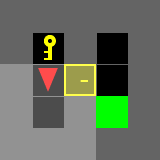
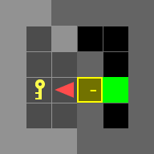
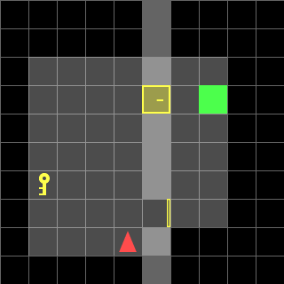

# Door & Key: Dynamic Programming for Robotic Navigation

This project implements a **Dynamic Programming (Value Iteration)** solution to the **Door & Key navigation problem** in grid environments.
In this task, an agent (robot) must navigate through a maze of walls and doors, collect a key if necessary, and unlock doors to reach the goal with minimal energy cost. The project casts the navigation task as a **Markov Decision Process (MDP)** and uses dynamic programming to compute optimal control policies for two scenarios:

1. **Known Map:** Environment fully known.
2. **Random Map:** Environment partially randomized.

The code produces optimal policies and visualizes agent trajectories.

## Examples
Known Map Trajectories
<p align="center">    </p>
Random Map Trajectory
<p align="center">  </p>

## Project Structure

```
.
├── create_env.py      # Setup MiniGrid Door & Key environments (known & random)
├── doorkeyA.py        # Solution for Known Map environments (7 maps)
├── doorkeyB.py        # Solution for Random Map (universal policy for 36 maps)
├── example.py         # Demo script for running example environments
├── utils.py           # Helper functions (trajectory plotting, video generation)
├── requirements.txt   # Python package dependencies
```

## Setup & Installation

1. Clone this repository:

```bash
git clone https://github.com/ivanlin328/Door-Key-Dynamic-Programming-for-Robotic-Navigation
.git
cd Door-Key-Dynamic-Programming-for-Robotic-Navigation

```

2. (Optional but recommended) Create a virtual environment:

```bash
python3 -m venv venv
source venv/bin/activate
```

3. Install dependencies:

```bash
pip install -r requirements.txt
```

Required packages include:

* `gymnasium==0.28.1`
* `minigrid`
* `numpy`
* `matplotlib`
* `imageio`

## How to Run

### Solve Known Map

```bash
python doorkeyA.py
```

Computes optimal policy and visualizes agent trajectory on known static environments.

### Solve Random Map

```bash
python doorkeyB.py
```

Computes a single robust policy that generalizes to all randomized Door & Key maps (10x10 grids with random key/goal/door states).

### Run Example

```bash
python example.py
```

Demonstration of environment setup and agent rollout.


